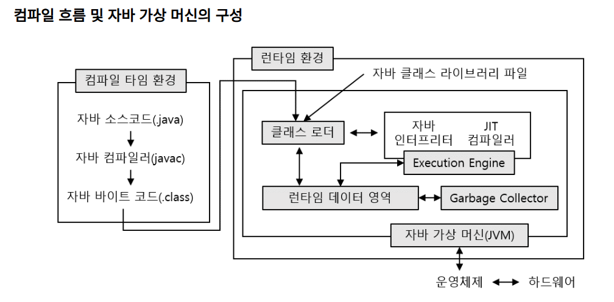
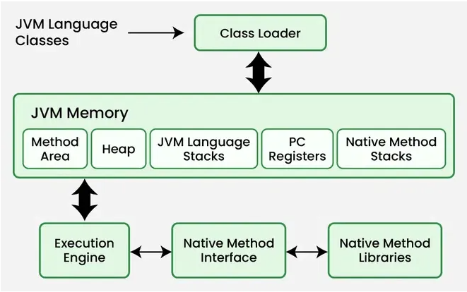
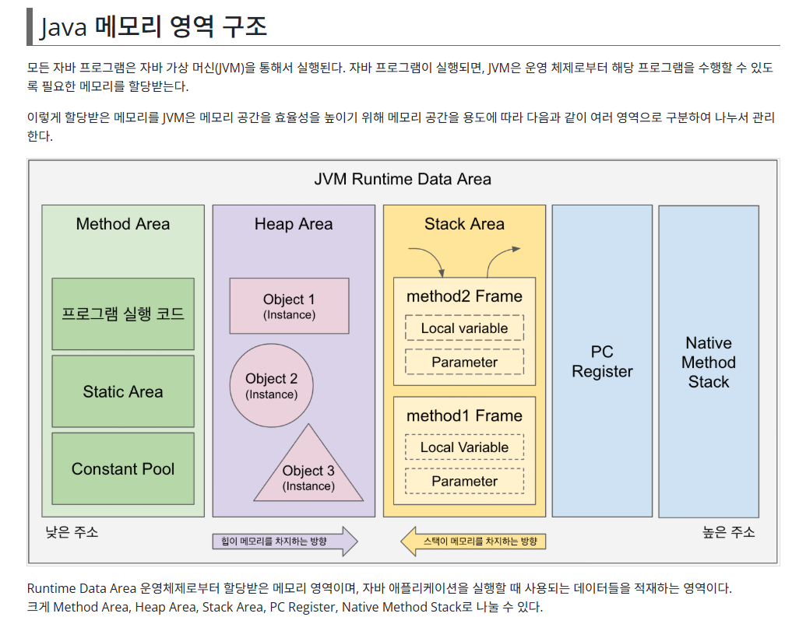

# 1. 자바 프로그래밍 구조
#### - 자바 프로그램은 class 단위로 생성된다.
#### - class명은 파일명과 동일하고, 반드시 첫글자는 대문자로 한다. 두 단어가 연결되는 경우에는 두번째 단어의 첫글자도 대문자로 한다.
####	예) Hello.java, HelloWorld.java ...
#### - 프로그램 실행을 위해서는 반드시 main 메소드를 포함해야 한다.  
####    public static void main(String[] args) {  실행 로직 }  - 수정 가능한 곳은 args
#### - 대소문자를 구분하여 프로그램을 작성한다.
#### - 주석처리 /(한줄), /*~*/(여러줄), /**~*/(JAVA Doc 문서)을 사용한다. 주석 단축키 : ctrl + /
#### - 실행로직은 {}(블록) 단위로 구성된다.
 
         
# 2. 네이밍 규칙
### (1) 파스칼 케이스(Pascal Case)
#### - 첫글자를 대문자로 작성하고, 연결되는 단어의 첫글자도 대문자로 작성한다.
#### - 예시) WELCOMETOHELLOJAVA  --> WelcomeToHelloJava
#### - 자바의 클래스명 정의에 사용한다.

### (2) 카멜 케이스(Camel Case)
#### - 첫글자를 소문자로 작성하고, 연결되는 단어의 첫글자들은 대문자로 작성한다.
#### - 예시) WELCOMETOHELLOJAVA  --> welcomeToHelloJava
#### - 자바의 변수명, 상수명, 메소드명 정의에 사용한다.  

### (3) 케밥 케이스(Kebab Case)
#### - 단어들의 연결을 -(하이픈)으로 하고 전체 소문자로 작성한다.
#### - 예시) WELCOMETOHELLOJAVA  --> welcome-to-hello-java

### (4) 스네이크 케이스(Snake Case)
#### - 단어들의 연결을 _(언더바)로 작성하고 전체 소문자로 작성한다.
#### - 예시) WELCOMETOHELLOJAVA  --> welcome_to_hello_java
#### - 자바의 패키지, 프로젝트 정의에 사용한다.
#### - 데이터베이스의 데이터베이스명, 테이블명, view명 등... 정의 사용한다.

     
# 3. 자바 프로그램 실행 로직
### 🌸[프로그램 실행 환경]
#### 한국인 		----------------------- 미국인(한국어O)
#### 한국인(영어X) -------번역기/통역관----- 미국인(한국어X)     
#### 사람(개발언어: 영어,숫자) ----------컴파일러/인터프리터-------- 기계(기계어: 이진수)
---               
  
                     
#### - 기계는 기계어를 사용하고, 기계어는 이진수(0,1)로 작성된다.
#### - 컴파일러(compiler) : 프로그램 코드 전체를 읽어서 실행파일을 생성하는 형식 --> C언어, Fortran, Cobol ...
#### - 인터프리터(interpreter) : 프로그램 코드 한줄씩 읽어서 바로 실행하는 형식 --> HTML, JavaScript...
#### - 하이브리드(hybrid) :  컴파일러 + 인터프리터 --> JAVA

### (1) 자바 컴파일 환경 : 컴파일 + 인터프리터 
#### - Hello.java ---------------> Hello.class -----------------> JRE(Java Runtime Environment)에서 실행
#### -  (원시코드)   컴파일러(javac)   (바이트코드)     인터프리터
---

### (2) 자바 런타임 환경(JRE: Java Runtime Environment)   

---

#### [참고주소] : https://www.devkuma.com/docs/jvm/memory-structure/

